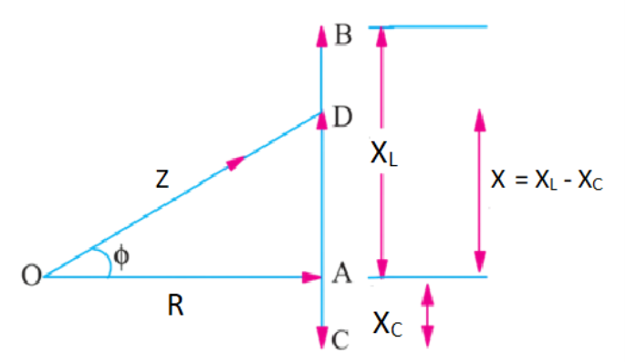

# Series RLC Circuit 

### Theory

<head>

</head>

 

We have the three basic passive components Resistance, capacitance and Inductance. When connected to a sinusoidal alternating voltage source they have different phase relationship with each other. But we can connect these passive elements together to form a series RLC circuit in series with an applied voltage supply.

Figure 1: Series RLC circuit

 

In a pure ohmic resistor the voltage waveforms are **"in-phase"** with the current. In a pure inductance the voltage waveform **"leads"** the current by 90° and in a pure capacitance the voltage waveform **"lags"** the current by 90°

The series RLC circuit above has a single loop so the same instantaneous current will flow through each element. Here the inductive and capacitive reactance $X_L$ and $X_C$ are functions of supply frequency so the sinusoidal response of the series RLC circuit will vary with the frequency f. Then the individual voltage drops across each circuit element of R, L and C element will be **"out-of-phase"** with each other as defined by:

 

$$ I(t) = I~max~ sin(ωt) $$ 

 

The instantaneous voltage across a pure resistor, $V_R$ is **"in-phase"** with current. The instantaneous voltage across a pure inductor, $V_L$ **"leads"** the current by 90°. The instantaneous voltage across a pure capacitor, $V_C$ **"lags"** the current by 90°. Therefore, $V_L$ and $V_C$ are 180° "out-of-phase" and in opposition to each other.

For above series circuit amplitude of the source voltage across all three components in a series RLC circuit is made up of the three individual component voltages, $V_R$, $V_L$ and $V_C$ with the current as common to all three voltages. Therefore, the vector diagram will be drawn as current vector as reference and the three voltages will be plotted with this reference. We cannot simply add the three voltages as they are vector quantities to find the supply voltage $V_S$. So, to find the supply the voltage $V_S$ we need to phasor sum of the three component voltages.

 

By applying KVL in the circuit:-

 

$$V_S - V_R - V_L - V_C = 0$$

$$V_S - I_R-L\frac {di} {dt}-\frac {Q}{C} =0 $$

$$V_S = I_R+L\frac {di} {dt}+\frac {Q}{C} =0 ....(1)   $$ 

 

As the current flowing in the circuit is common to the all three circuit elements we can use this as a reference vector with the three voltage vector drawn relative to the reference current vector.

The resulting vector $V_S$ is obtained by adding $V_L$ and $V_C$ and the adding this sum to the remaining vector $V_R$. The angle obtained between $V_S$ and I will be the circuit phase angle as shown below.

Figure 2: Voltage Triangle

 

This triangle obtained is also called voltage triangle. 
Here, Magnitude of voltage.

$$|V_S |= \sqrt{(V_R)^2+(V_L-V_C)^2  }.........(2)$$

Here the final reactive voltage must be positive value. i.e for inductive circuit it would be $(V_L-V_C)$ and for capacitive circuit it will be $(V_C-V_L)$.
Current has same phase and amplitude in all components of series RLC circuit so voltage across each component can be described mathematically according to the current flowing through as shown

$$V_R=iRsin(ωt+0°)$$

$$V_L=iX_L sin(ωt+90°)=i.jωL$$

$$V_C=iX_C sin(ωt-90°)=i.\frac {1} {jwc}$$

By substituting these values into the voltage triangle equation above-

$$V_R=IR , V_L=IX_L , V_C=IX_C $$

$$V_S=\sqrt{(IR)^2+ (IX_L-IX_C)^2  }$$

$$V_S=I\sqrt{(R)^2+ (X_L-X_C)^2 }$$

 

On comparing this equation with the equation 1 we can obtain the impedance triangle

Figure 3: Impedance triangle

 

The impedance Z of the series RLC circuit depends on the frequency ω as $X_L$ & $X_C$ also depends on it. The impedance of circuit can be written as

 

  

  $$ Impedance, Z = \sqrt{R^2+ (ωL-\frac {1}{ωC})^2 }.........(3) $$

 

The phase angle, Ø between the source voltage $V_S$ and the current I is the same as the angle between Z and R in the impedance triangle. This angle may be positive and negative depending on whether the source voltage is leading or lagging the current. From the impedance triangle phase angle can be calculated as-

$$ Power factor, Cos∅ = \frac{R}{Z} .........(4) $$

$$sin⁡∅ = \frac{(X_L-X_C)} {Z}$$

$$tan⁡∅ = \frac{(X_L-X_C)} {R}$$

Further, Power absorbed in the circuit can be calculated as,

$$Apparent Power,S = VI$$

$$Active Power,P=VI cos∅$$

$$Reactive Power,Q= VI sin∅$$

### Advantages of Series RLC circuit

*  No separate compensating reactors (just as we have in case of test transformers) are required. This results in a lower overall weight. 
*  When testing SF6 switchgear, multiple breakdowns do not result in high transients. Hence, no special protection against transients is required. 
*  The series resonance circuit suppresses harmonics and interference to a large extent. The near sinusoidal wave helps accurate partial discharge of measurements and is also desirable for measuring loss angle and capacitance of insulating materials using Schering Bridge.

### Disadvantages of Series RLC circuit

*  If one point breaks in the series circuit, the total circuit will break.
*  As the number of components in a circuit increases, greater will be the circuit resistance.

