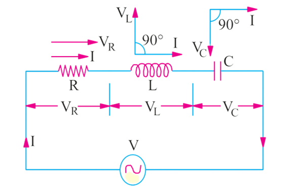
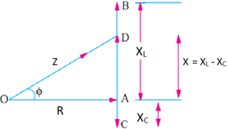

# Series RLC Circuit 

### Theory

A series RLC circuit is a basic electrical circuit consisting of a resistor (R), an inductor (L), and a capacitor (C) connected in series with a voltage source. 
The components interact to create a circuit with unique electrical characteristics that depend on the frequency of the applied voltage.

Figure 1: Series RLC circuit

 

In this arrangement: 

•	The resistor (R) opposes current flow and dissipates energy as heat. 
•	The inductor (L) opposes changes in current and stores energy in its magnetic field. 
•	The capacitor (C) opposes changes in voltage and stores energy in its electric field. 

In a pure ohmic resistor the voltage waveform is **"in-phase"** with the current. In a pure inductance the voltage waveform **"leads"** the current by 90° and in a pure capacitance the voltage waveform **"lags"** the current by 90°.

Let,   

 VR  =  IR  = voltage drop across R   -in phase with I 
 VL  = I.XL = voltage drop across L   -leading I by π/2 
 VC  = I.XC = voltage drop across C   -lagging I by π/2 

**Inductive Reactance XL**: The opposition to current flow due to the inductor is given by:
                                  
 XL = 2πf L 
  
Where f is the frequency of the AC supply and L is the inductance of the inductor.

**Capacitive Reactance XC**: The opposition to current flow due to the capacitor is given by
                                
 XC = 1/2πf C  
  
where C is the capacitance of the capacitor.

Figure 2: Voltage triangle

In the voltage triangle of Fig. 2, OA represents VR, AB and AC represents the inductive and capacitive drops respectively. It will be seen that VL and VC are 180° out of phase with each other i.e., they are in direct opposition to each other. 

Subtracting BD from AB, we get the net reactive drop AD = I (XL - XC). 
The applied voltage V is represented by OD and is the vector sum of OA and AD. 

Therefore, 

 

$OD = \sqrt{OA^2 + AD^2} \quad \text{or} \quad V = \sqrt{(IR)^2 + (IX_L - IX_C)^2} = I\sqrt{R^2 + (X_L - X_C)^2}$    
or $ I= \frac {V}{\sqrt{R^2 + (X_L - X_C)^2}} = \frac{V}{\sqrt{R^2+X^2}}=  \frac {V}{Z}$

The term $\sqrt{R^2 + (X_L - X_C)^2}$ is known as the impedance of the circuit. Obviously,   
$(\text{impedance})^2 = (\text{resistance})^2 + (\text{net reactance})^2$   

or $Z^2 = R^2 + (X_L - X_C)^2 = R^2 + X^2$

Where R is the resistance and X is the net reactance shown in Fig.3

Figure 3: Impedance triangle

The phase angle &straightphi; is given by:

$\tan \phi = \frac{X_L - X_C}{R} = \frac{X}{R} = \frac{\text{net reactance}}{\text{resistance}}$

$\text{Power factor is } \cos \phi = \frac{R}{Z} = \frac{R}{\sqrt{R^2 + (X_L - X_C)^2}} = \frac{R}{\sqrt{R^2+X^2}}$

Hence, it is seen that if the equation of the applied voltage is v = Vm sinωt, then the equation of the resulting current in an RLC circuit is given by i = Im sin (ωt + ∅).
The +ve sign is to be used when current leads i.e., XC > XL.
The -ve sign is to be used when current lags i.e., XL > XC.

Further, Power absorbed in the circuit can be calculated as, 

 Apparent Power, S = VI  
Active Power, P = VI cos∅  
Reactive Power, Q = VI sin∅   

<b>Advantages of series RLC circuit:</b> 

1. Series RLC circuits can be utilised to improve the power factor in AC power systems, reducing energy losses and enhancing efficiency. 
2. Series RLC circuits are easy to design and analyse, making them ideal for filtering and tuning applications. 
3. Amplify voltages across the inductor and capacitor at resonance, useful in oscillators and signal generation. 
4. In antenna design, Series RLC circuits help achieve resonance at desired operating frequencies, maximising radiation  efficiency. 

<b> Disadvantages of series RLC circuit:</b> 

1. Excessive current or voltage can also lead to overheating or damage to the resistor, inductor, or capacitor, reducing the circuit's lifespan. 
2. If one point breaks in the series circuit, the total circuit will break. 

